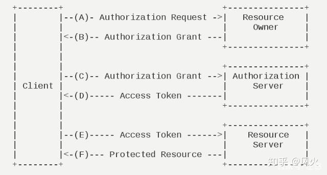
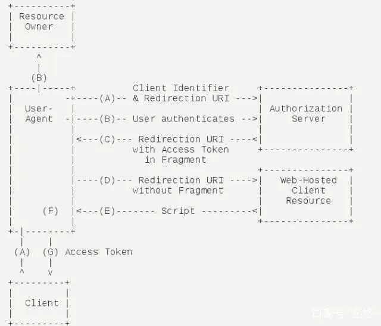
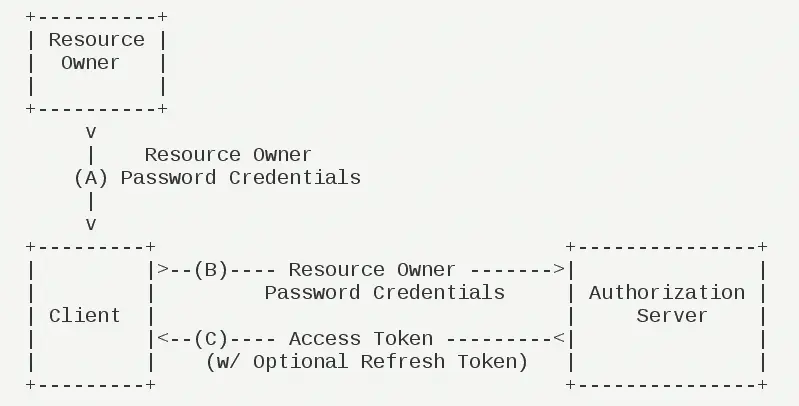

## 什么是OAuth2

OAuth2是一个服务开放（授权）标准，它表示允许用户授权第三方应用访问该用户在另外一个服务器存储的用户信息，而不用将存储在该服务器的用户名以及密码或所有用户信息告知给第三方应用。

## OAuth2的应用场景

当你想使用QQ登录的第三方应用时，此时第三方应用需要获取你的QQ信息（昵称、头像、openid等），但是又不能直接用户名和密码等信息。那么此时就需要你登录你的QQ服务器，然后授权给该第三方应用一部分信息。而OAuth2就是为了实现上述目标而制定的一种规范。

## Oauth2的授权模式

- 授权码（authorization code）
- 隐藏式（implicit）
- 密码式（resource owner password credentials）
- 客户端凭证（client credentials）

### 授权码

授权码模式，指的是第三方应用先申请一个授权码，然后再拿着该授权码获取令牌。

1. 用户访问第三方应用客户端，随后该客户端跳转到认证服务器，跳转的过程中附带上重定向URI。
2. 用户在认证服务器给予授权之后，跳转到事先定义好的redirect_uri，并返回上一个授权码，该授权码是与当前客户端绑定的，无法被其他客户端使用。
3. 客户端收到该授权码，携带上步骤1中的redirect_uri，向认证服务器申请令牌。请求成功后认证服务器会返回一个令牌，该令牌存在一个有效时间。
4. 客户端拿到该令牌之后，将该令牌携带在请求中请求资源服务器，资源服务器判断该令牌的有效性，最终判断是否返回有效的资源信息。

### 隐藏式

当有些网站时纯前端架构的时候，就无法通过后端来使用上述的授权模式了，令牌必须存在前端。该模式下不通过第三方应用的服务器，直接在浏览器里想认证服务器申请令牌，跳过了授权码的步骤。所有步骤都是在浏览器内完成，令牌对访问者是可见的，并且客户端不需要认证。

1. 客户端在页面内放置一个链接，该链接指向认证服务器
2. 用户点击授权，给该客户端授权
3. 认证服务器在授权之后将跳转到客户端指定的redirect_uri，并将令牌包含在URI中，其中令牌并不是以查询参数的形式存储在URI中，而是以锚点的形式存储。
4. 浏览器想服务器发起请求，资源服务器返回一个网页，网页内包含一个可以获取上述令牌的脚本
5. 浏览器执行脚本，提取令牌，发送给客户端
6. 客户端拿到令牌向资源服务器请求，资源服务器判断该令牌的有效性，最终判断是否返回有效的资源信息。

### 密码式

听名字我们就可以知道，该授权模式需要密码来进行。其实质是，如果你高度信任某个应用，那么可以直接告诉这个应用你的用户名和密码，然后该应用拿到这些信息去申请令牌。

1. 用户向第三方应用提供用户名和密码
2. 该应用将用户名和密码发送给认证服务器，然后请求令牌
3. 认证服务器确认无误后，想客户端提供令牌
4. 客户端拿到令牌向资源服务器请求，资源服务器判断该令牌的有效性，最终判断是否返回有效的资源信息。

### 客户端凭证

客户端凭证模式下，即是通过客户端的名义，而不是用户的名义去获取令牌。该模式下可以在纯后端进行，常见的参数有client_id、client_secret。

1. 客户端向认证服务器发送一个携带client_id和client_secret的请求
2. 认证服务器接收到客户端请求，并验证client_id和client_secret的有效性，如果有效这向客户端提供令牌。